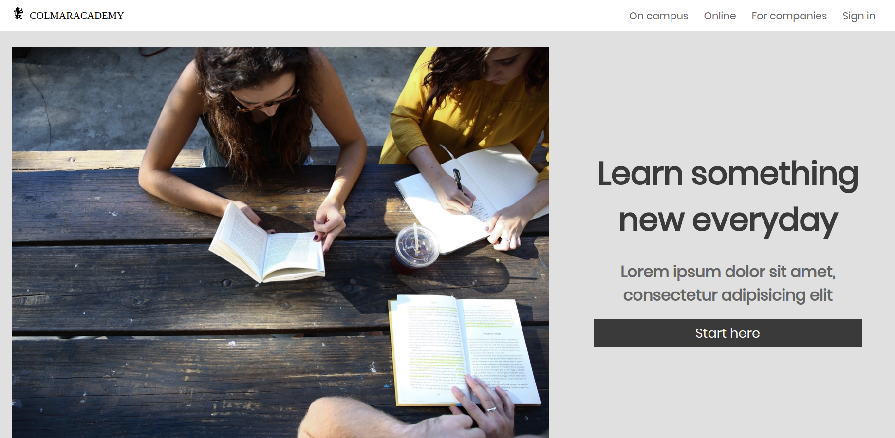

# COLMARACADEMY Replica Website
A replica of a fictional website called Colmaracademy. It's a capstone project on Codecademy.
## Technologies

- HTML
- CSS

## Developed by

Mouhamadou Diouf ( <a href="https://github.com/MouhaDiouf"> @mouhad </a>)

## Live Version
Live version can be found here: <a href="https://mouhadiouf.github.io/colmaracademy/" target="_blank"> Colmaracademy Website </a>

## Contributing

1. Fork it (https://github.com/MouhaDiouf/colmaracademy)
2. Create your feature branch (git checkout -b feature/[choose-a-name])
3. Commit your changes (git commit -am 'What this commit will fix/add')
4. Push to the branch (git push origin feature/[chosen name])
5. Create a new Pull Request
